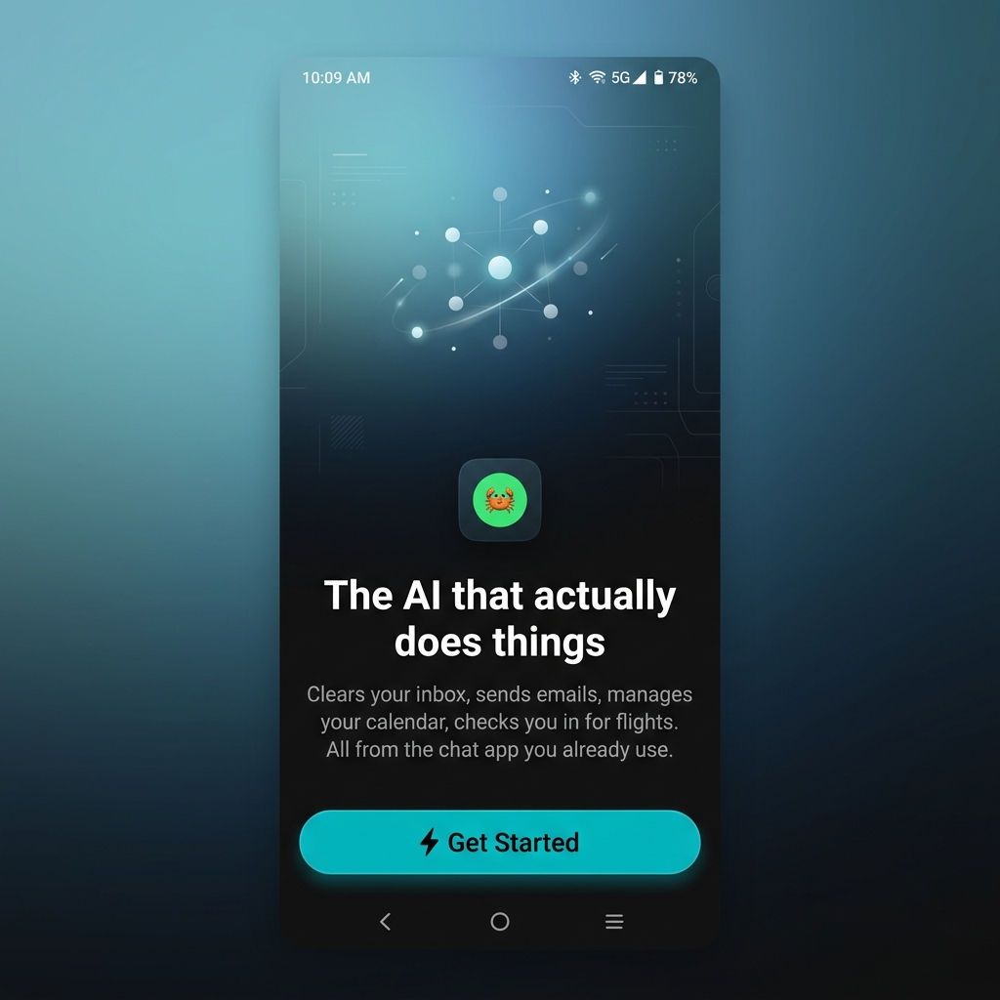
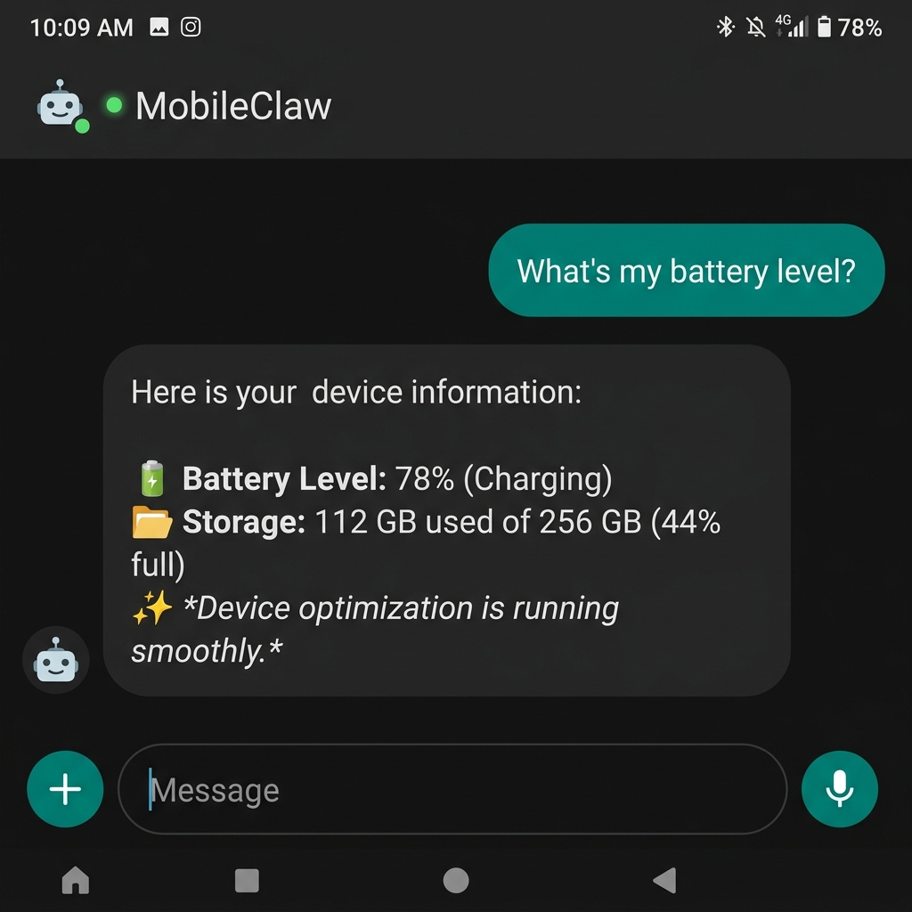
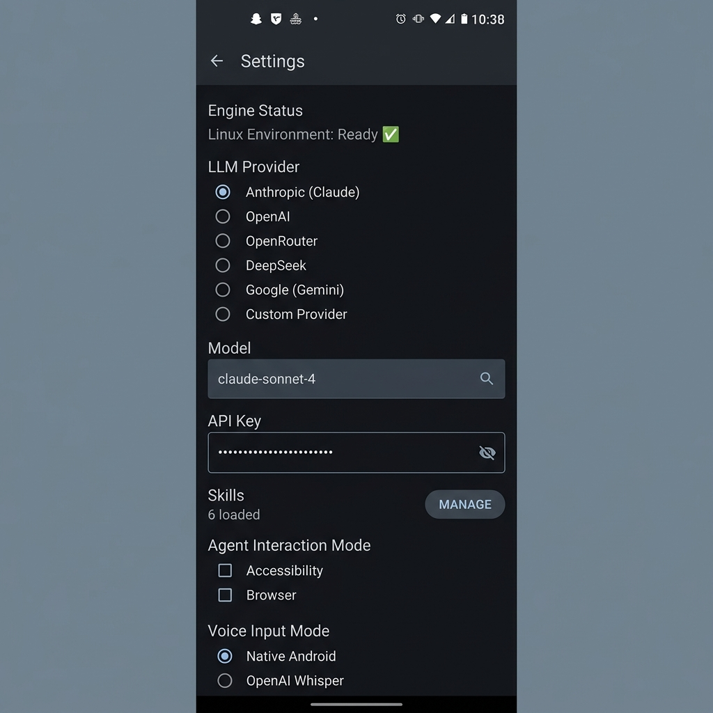
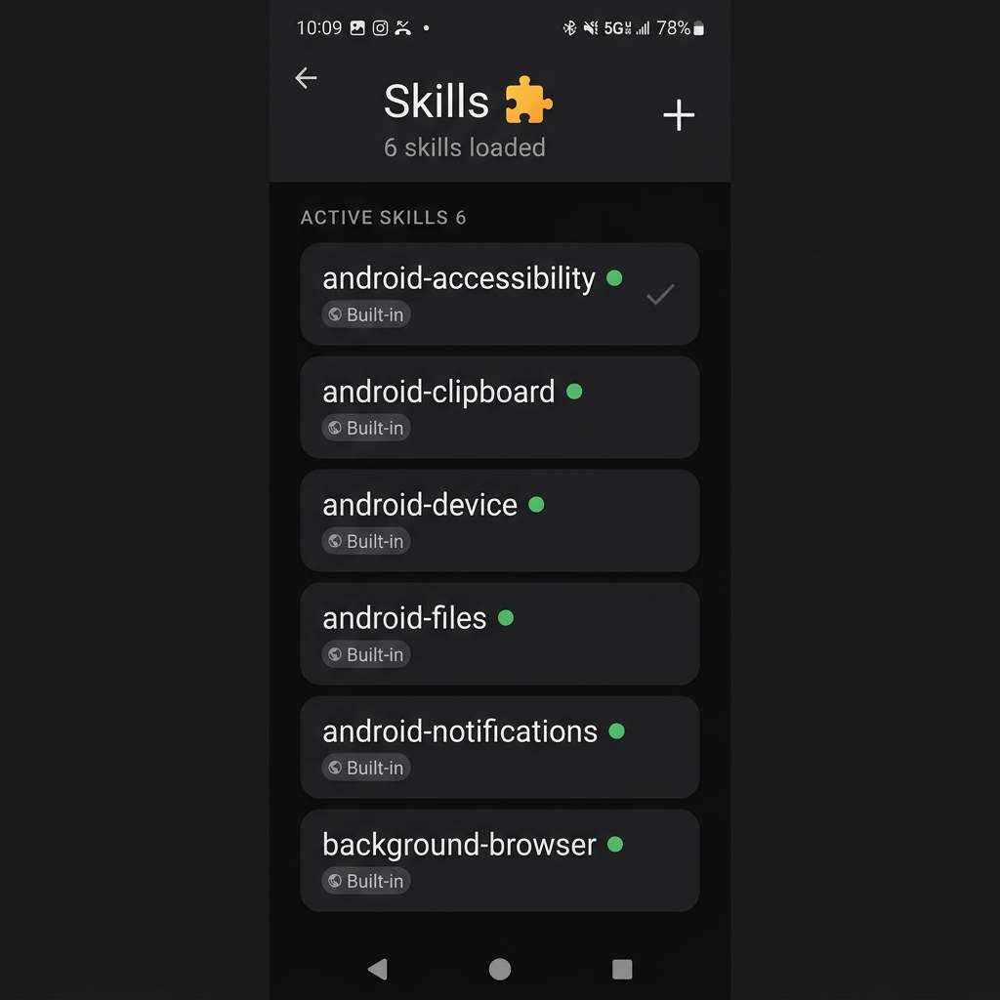

<p align="center">
  
</p>

<h1 align="center">NeoClaw</h1>

<p align="center">
  <strong>The AI that actually does things.</strong><br/>
  An open-source AI agent that lives on your Android phone — controls apps, runs Linux commands, browses the web, manages your calendar, and more.
</p>

<p align="center">
  <a href="https://play.google.com/store/apps/details?id=com.parth.neoclaw">
    
  </a>
</p>

<p align="center">
  <a href="https://neoclaw.parthchoudhary.com">Website</a> •
  <a href="#features">Features</a> •
  <a href="#screenshots">Screenshots</a> •
  <a href="#building">Building</a> •
  <a href="https://github.com/niceparth/NeoClaw/issues">Issues</a>
</p>

---

## What is NeoClaw?

NeoClaw is a fully on-device AI agent for Android. Unlike chatbots that only generate text, NeoClaw **actually does things** — it controls foreground apps via Accessibility, browses the web in the background, executes Linux commands via an embedded Alpine Linux environment (proot), toggles your flashlight, sends SMS, creates calendar events, and much more.

Bring your own API key. Pick any LLM provider. Your data stays on your device.

---

## Screenshots

<p align="center">
  
  &nbsp;&nbsp;
  
  &nbsp;&nbsp;
  
  &nbsp;&nbsp;
  
</p>

---

## Features

### 🤖 Multi-Provider LLM Support
Pick your brain. NeoClaw supports **10+ LLM providers** out of the box:

| Provider | Models |
|----------|--------|
| **Anthropic** | Claude Sonnet 4, Claude 3.7 Sonnet, Claude 3.5 Haiku, Claude 3 Opus |
| **OpenAI** | GPT-5.4, GPT-5o, GPT-4.1, o4-mini, o3, and more |
| **Google** | Gemini 2.5 Pro, Gemini 2.0 Flash |
| **OpenRouter** | 30+ models from all providers via a single key |
| **DeepSeek** | DeepSeek Chat, DeepSeek Coder, DeepSeek Reasoner |
| **Groq** | Llama 3.3 70B, Mixtral 8x7B (fast inference) |
| **Together AI** | Llama 2 70B, Llama 3 70B |
| **Aliyun** | Qwen Max, Qwen Plus, Qwen Turbo |
| **Zhipu AI** | GLM-4 Plus, GLM-4, GLM-4 Flash |
| **SiliconFlow** | DeepSeek V3, Qwen 2.5 72B, GLM-4 9B |
| **Custom** | Any OpenAI-compatible endpoint (Ollama, LM Studio, etc.) |

### 📱 Accessibility Agent (Foreground App Control)
Control **any app** on your phone through natural language:
- Read the visible screen of any app
- Tap elements by text or coordinates
- Type into text fields
- Scroll, swipe, and navigate
- Press system buttons (back, home, recents)
- Launch any installed app

### 🌐 Background Browser Agent
Browse the web silently without leaving the app:
- Open URLs in a background WebView
- Read page content as structured markdown
- Click buttons, fill forms, execute JavaScript
- Manage login sessions for authenticated browsing
- Smart fallback between accessibility and browser modes

### 🐧 Embedded Linux Environment
A full Alpine Linux shell running natively via proot — no root, no VM:
- Run any shell command (`curl`, `python3`, `ffmpeg`, `git`, etc.)
- Install packages with `apk add`
- Read, write, and manage files
- Clone repos, compress videos, process data

### 🔧 40+ Native Device Tools
Direct hardware and OS integration:

| Category | Tools |
|----------|-------|
| **Phone** | Send SMS, make calls, create contacts |
| **Calendar** | Create events with full date/time support |
| **Alarms** | Set alarms and countdown timers |
| **Camera** | Take photos, share files |
| **Hardware** | Flashlight toggle, WiFi/Bluetooth settings |
| **Location** | GPS coordinates, open maps |
| **Clipboard** | Read and write clipboard |
| **Notifications** | Send local notifications |
| **Device Info** | Battery, storage, model, OS version |

### 🧠 Persistent Memory
The agent remembers things across conversations — your name, preferences, and context.

### ⏰ Task Scheduling
Schedule recurring AI tasks:
- Daily, weekly, or custom intervals
- One-time delayed tasks
- Automatic notification delivery

### 🧩 Extensible Skill System
- 6 built-in skills for device control
- Install custom skills from any Git repository
- Skills extend the agent's system prompt with new capabilities
- Manage skills from the built-in Skill Browser

### 🎤 Voice Input
- Native Android speech recognition
- OpenAI Whisper for higher accuracy
- Microphone button in the chat bar

### 📎 Rich Attachments
Attach context to your messages:
- Images, documents, and files
- Camera capture
- GPS location
- Contacts

---

## Building from Source

### Prerequisites

- **Android Studio** Hedgehog (2023.1) or later
- **JDK 17**
- **Android SDK 34** (API level 34)
- An API key from any supported provider

### Clone & Build

```bash
# Clone the repository
git clone https://github.com/niceparth/NeoClaw.git
cd NeoClaw

# Open in Android Studio
open -a "Android Studio" android/

# Or build from command line
cd android
./gradlew assembleDebug
```

The APK will be at `android/app/build/outputs/apk/debug/app-debug.apk`.

### Install on Device

```bash
# Via ADB
adb install android/app/build/outputs/apk/debug/app-debug.apk
```

Or transfer the APK to your phone and install directly.

### First Launch

1. Grant **Notification** and **Accessibility** permissions
2. Select your **LLM provider** (Anthropic, OpenAI, Google, etc.)
3. Enter your **API key**
4. Start chatting — the agent will introduce itself

---

## Architecture

```
com.parth.neoclaw/
├── engine/
│   ├── AgentOrchestrator.kt    # Main agentic loop — LLM ↔ tool execution
│   ├── LinuxExecutor.kt        # proot + Alpine Linux shell
│   └── GoClawBridge.kt         # System prompt builder + skill loader
├── llm/
│   └── LLMService.kt           # Multi-provider LLM client (streaming SSE)
├── bridge/
│   └── DeviceBridge.kt          # Native Android hardware APIs
├── accessibility/
│   └── NeoClawAccessibilityService.kt  # Screen reading + UI control
├── browser/
│   └── AgentBrowserService.kt   # Background WebView automation
├── ui/
│   ├── ChatScreen.kt            # Main chat interface
│   ├── SettingsScreen.kt        # Provider, model, skill, mode settings
│   ├── OnboardingScreen.kt      # First-launch setup wizard
│   └── SkillBrowserScreen.kt    # Skill management + Git installer
├── scheduling/
│   └── TaskScheduler.kt         # Recurring task engine
├── speech/
│   └── SpeechService.kt         # Voice input (native + Whisper)
└── storage/
    └── SecureStorage.kt         # Encrypted API key storage
```

---

## Tech Stack

- **Language:** Kotlin
- **UI:** Jetpack Compose + Material Design 3
- **Linux:** Alpine Linux via proot (no root required)
- **LLM:** Streaming SSE with OkHttp
- **Storage:** Room DB (messages) + EncryptedSharedPreferences (API keys)
- **Location:** Google Play Services Fused Location
- **Min SDK:** 26 (Android 8.0)

---

## Contributing

Contributions are welcome! Please:

1. Fork the repository
2. Create a feature branch (`git checkout -b feature/amazing-feature`)
3. Commit your changes (`git commit -m 'Add amazing feature'`)
4. Push to the branch (`git push origin feature/amazing-feature`)
5. Open a Pull Request

---

## License

This project is open source. See [LICENSE](LICENSE) for details.

---

<p align="center">
  Built with 🦀 by <a href="https://parthchoudhary.com">Parth Choudhary</a><br/>
  <a href="https://neoclaw.parthchoudhary.com">neoclaw.parthchoudhary.com</a>
</p>
